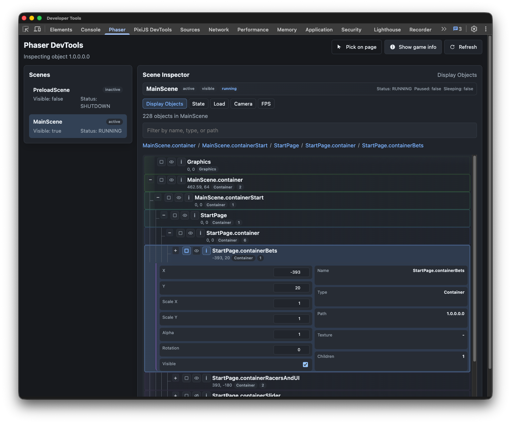

# Phaser DevTools

Phaser DevTools is a Chrome DevTools extension that adds a dedicated `Phaser` panel for inspecting Phaser 3 games in real time.

## What You Can Do

- Open a native `Phaser` tab inside Chrome DevTools.
- Detect Phaser games using common globals plus fallback heuristics.
- Detect module-scoped game instances via an early page hook.
- Inspect core game metadata:
  - detection state
  - width / height
  - renderer type
  - scene count
- Browse all scenes with quick state info:
  - key
  - active
  - visible
- Explore a recursive display object tree for a selected scene.
- Inspect selected object properties:
  - name, type, tree path
  - x, y, scaleX, scaleY
  - alpha, visible, rotation
  - texture key
- Toggle selected object visibility from the panel.
- Highlight selected objects on the page.
- Click-to-pick objects directly from the game canvas and sync selection back to the panel.
- Refresh data manually, plus lightweight auto-refresh when the panel regains focus.

## Screenshot

## Install for Development (Unpacked)

1. Open `chrome://extensions`.
2. Enable `Developer mode`.
3. Click `Load unpacked`.
4. Select the project `extension/` folder (this repo's `extension` directory).
5. Open a Phaser game page, then open DevTools.
6. Use the `Phaser` tab.

## Install from Chrome Web Store

After publication, install directly from the Chrome Web Store listing (link to be added here).

## Current Constraints

- Detection relies on heuristics plus an early hook. If you reload the extension after the page starts, refresh the page so the hook runs before the game is created.
- Object identity is path/index based. If scene tree/display list order changes, previous selections may no longer match the same object.
- Outline/highlight and click-to-pick are bounds-based, so rotated or unusual render cases can be approximate.
- The extension is read-only (no live property editing).
- Chromium-based DevTools support is the current target platform.
